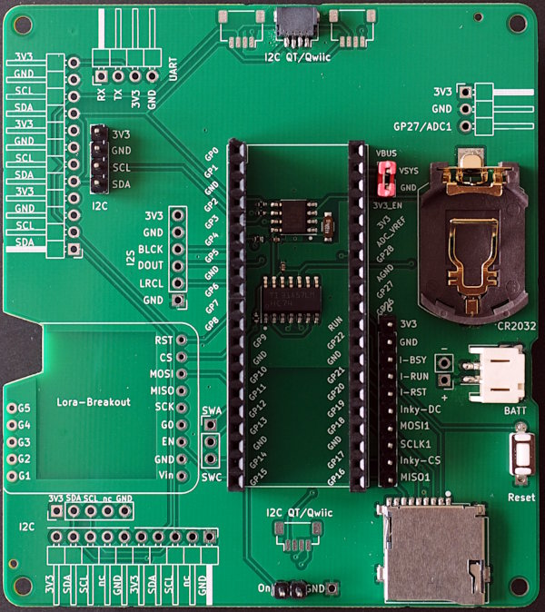
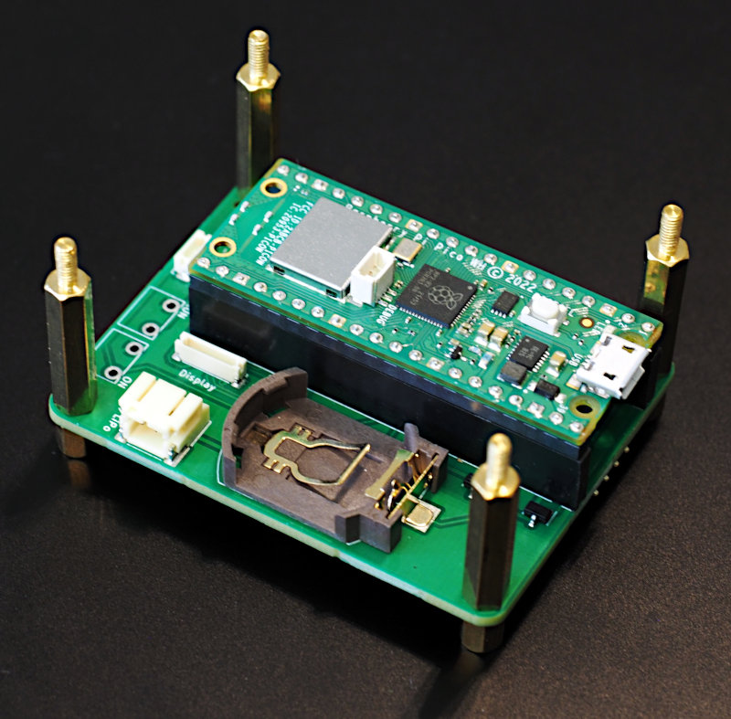
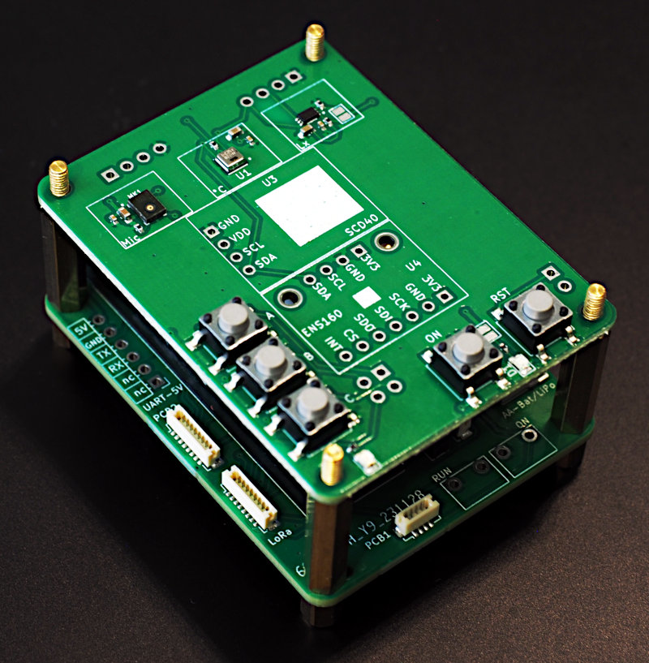

Pico Datalogger with Integrated Power-Management
================================================

This is a breakout supporting low-frequency data-logging with a Raspberry Pi Pico.

Version 1 PCB:

Version 2 PCB:

Sensor PCB (in combination with datalogger-v2):

Core functions:
  * log data to a micro-sd card;
  * software-controlled power-control with very low standby current.

From a technical viewpoint the breakout allows you to
  * turn on the system using a button or
  * use a RTC-alarm to trigger wakup,
  * turn off the system using a dedicated digital-io,
  * power the system from a lipo or battery-pack,
  * keep time using a coincell backup-battery even if the board is not powered.

Quick Links
-----------

  * [Basic Setup](docs/setup.md)
  * [Software](docs/software.md)
  * [Software deployment](docs/deployment.md)
  * [Configuration](docs/configuration.md)
  * [Initial setup of the RTC](docs/rtc_setup.md)
  * [Administration mode](docs/admin_mode.md)

Background
----------

For background on / motivation for this project, please see
<https://opendeved.net/programmes/ilce-in-tanzania/>.

Additional resources
--------------------

  * [Sensors](docs/sensors.md)
  * [Components](docs/components.md)
  * [Hardware Architecture](docs/hw_architecture.md)
  * [Power](docs/power.md)
  * [Pinout](docs/pins.md)
  * [Pinout V2](docs/pins-v2.md)
  * Case for this PCB: https://github.com/OpenDevEd/case-for-pico-datalogger-rev1.00
  * [KiCAD design-files V1](./pico-datalogger.kicad/Readme.md)
  * [KiCAD design-files V2](./pico-datalogger-v2.kicad/Readme.md)
  * [KiCAD design-files sensor-PCB](./pico-sensor-pcb.kicad/Readme.md)
  * [KiCAD design-files display-adapter](./display-adapter.kicad/Readme.md)
  * [KiCAD design-files LoRa-adapter](./lora-adapter.kicad/Readme.md)
  * [References](docs/references.md)

License
-------

Software in `src` is licensed under the GPL3. Hardware is licensed by:

[![CC BY-SA 4.0][cc-by-sa-shield]][cc-by-sa]

This work is licensed under a
[Creative Commons Attribution-ShareAlike 4.0 International
License][cc-by-sa].

[![CC BY-SA 4.0][cc-by-sa-image]][cc-by-sa]

[cc-by-sa]: http://creativecommons.org/licenses/by-sa/4.0/
[cc-by-sa-image]: https://licensebuttons.net/l/by-sa/4.0/88x31.png
[cc-by-sa-shield]:
https://img.shields.io/badge/License-CC%20BY--SA%204.0-lightgrey.svg
