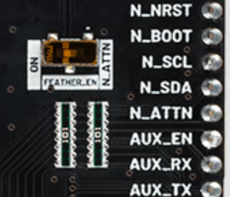
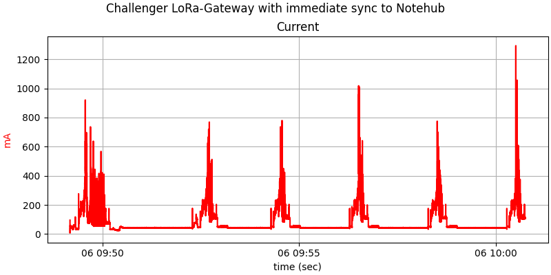
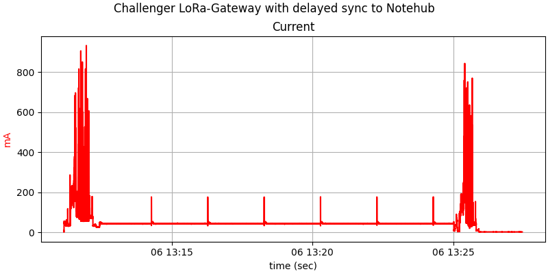

Installation, Configuration and Operation of the Blues-Gateway
==============================================================

Hardware
--------

The current hardware setup uses these components:

  - iLabs Challenger-RP2040-Lora
  - LoRa-antenna with u.FL connector
  - Blues Carrierboard F v1.3
  - Blues Notecard
  - LiPo-battery capable of providing 2A peak current
    (i.e. with at least 2000mAh capacity)
  - Solar-Panel with 6V

The Challenger, solar-panel and LiPo plug into the F-carrierboard. The
antenna plugs into the Challenger. **Since the F-carrierboard does not have
any over-discharge protection, the LiPo must provide the protection
itself!**

On the back of the F-carrierboard is a switch. Remove the protective
foil and use a very small screwdriver and push the switch to the right.

No additional hardware-setup is necessary for productive use.

Configuration
-------------

See [gateway configuration](./gateway_config.md).

Deployment
----------

The source of the software is in `src.blues_gateway`. It is complete
with the exception of two configuration files: `config.py` and
`log_config.py`. The recommended way of building and installing the
software is to use the Makefile in the toplevel directory:

    make gateway CONFIG=xxx.py LOG_CONFIG=yyy.py DEPLOY_TO=gw_challenger

This creates the directory `gw_challenger` with all the necessary
files. See [Software deployment](./deployment.md) for details about
the build-system. After the build is complete, copy all files below
`gw_challenger/` (or any other directory you use in the make-command)
to the device.

Operation
---------

The current implementation will run the gateway every day during an
*active window*. Both the start and end hour of the active window have to
be defined in `config.py`. The active window should match the time-table
of the dataloggers. The following setting will run the gateway from
07:00 - 17:00 every day:

    ACTIVE_WINDOW_START = 7:00  # active (online) window start time
    ACTIVE_WINDOW_END   = 17:00 # active (online) window end time

The very first startup of the gateway after a cold boot (i.e. after
power loss) will take a few minutes (up to 2 minutes here, to be
verified for Tanzania). Normal restarts are fast.

The notecard is a very low power-device (8µA) and should run 7x24. It
will wake up the Challenger on the F-carrierboard at the start of the
active window and will shutdown the device at the end of the active
window.

There are two methods of synchronisation of the data to the cloud
(i.e. to <https://nothub.io>):

  - synchronisation directly after receiving the data from the
    datalogger via LoRa
  - buffering the data on the notecard and synchronisation at the
    end of the active window

The modes are controlled by the variable `SYNC_BLUES_ACTION`:

  - `SYNC_BLUES_ACTION = True` will sync immediately
  - `SYNC_BLUES_ACTION = False` will sync after the end of the
    active window
  - `SYNC_BLUES_ACTION = None` will print to the log and discard the
    data (useful only during development)

The second option is for now the recommended option. It is more efficient
(less data-transfer, less power-consumption). The only reason *not* to
use the second option is the potential problem of a low-battery at
the end of the day (to be verified).

Power Requirements
------------------

Power consumption during the active window is dominated by the
Challenger listening for incoming LoRa-transmissions. At 3.6V, this
is about 44 mA. The following plot uses immediate sync, and the
node (datalogger) sends data every two minutes.

During sync with the cloud, the current rises to about 200 mA
with spikes up to 1200mA (for GPRS in Tanzania this is expected
to be much higher with up to 2A peak usage). The above plot (left side)
also demonstrates the additional current needed during a cold start.

In contrast, power consumption with delayed sync has this profile:

On the right side of the plot, the gatway shuts down at the end of
the active window. In this state, the gateway draws about 2mA.
This is mainly due to the Challenger - the onboard regulator does
not seem to shut down completely when the EN-pin of the feather
is pulled low.

The power requirement could be drastically reduced if the nodes would
only send once a day. In this case, the *active window* could be one
hour instead of ten hours. This needs changes in the way the nodes
operate and is planned for a future iteration. The gateway itself
already supports this alternative operation mode.

Solar Power Recommendations
---------------------------

Total energy-harvesting per day using a solar-panel should therefore
provide at least

    50 mAh * hours in receive-mode + 2mA * hours not in receive mode + ???mAh

The absolute term on the right side of the equation is for the final
sync to the cloud and depends on the amount of data sent by the nodes.
This has to be evaluated emperically.

So a typical 2W-panel (6V/330mA peak) should run at least at a mean of
20% of its peak performance. If possible, a larger panel (e.g. 3.5W)
should be used. Note that the charging range of the F-carrierboard is
3.94V-7.18V, so panels with other voltages (e.g. 5V) can be used as
long as they are in this range.
