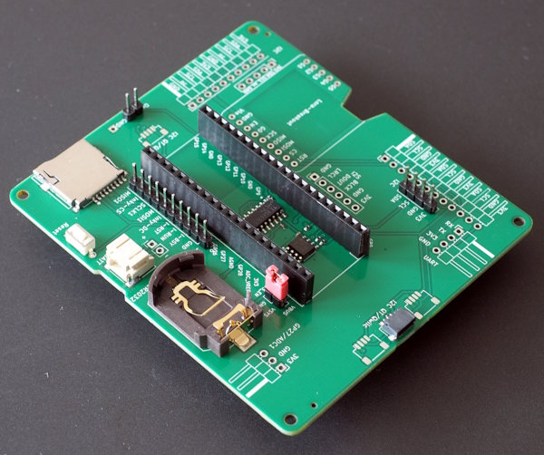

Hardware Architecture
=====================

The hardware of the breakout supports three main features:

  - Power management: the system toggles between "on" (doing measurements)
    and "off". In the off-state power-consumption is near zero.
  - Automatic wakup: the system can wakeup in fixed intervals or based on
    pre-configured time-points (e.g. at minute 00, 15, 30, 45 of every hour).
  - data-logging to an attached micro-SD card

Various additional connectors allow the user to connect sensors, 
a displays or a LoRa-breakout.

Power Management
----------------

Power management uses a D-type flip-flop. In the v1-pcb, the flip-flop
directly drives the enable pin of the Pico-(W). State changes of the flip-flop
are initiated either by a button, by the interrupt of the RTC or by the
Pico itself. The first two will turn power on, the last one will turn
power off.

When the flip-flop is in "reset"-state, the enable pin of the Pico is pulled
high and the Pico is running. The "done"-pin of the Pico is connected to the
CLK-pin of the flip-flop. A rising edge will toggle the enable pin, thus
turning the system off. The application firmware is in charge of toggling
the "done"-pin after finishing the current measurement cycle.

The v2-pcb does not drive the enable pin of the Pico, but a mosfet that
controls VSYS of the Pico. This is more efficient, since the Pico still
draws current even when the enable pin is pulled low.

Time Management
---------------

Time-keeping uses the PCF8523 RTC with integrated support for a backup-battery.
The PCF8523 supports time-based alarms from one minute to about a month
in the future.

It is the responsibility of the application firmware to set the next
wakeup time-point in the RTC prior to shutdown.

The backup-battery (coin-cell) for the PCF8523 only maintains (time) state,
it does not allow to run the system. Switchover to maintainance mode
occurs when VSYS is below V(th) of the coin-cell, which is normally around
2.5V. This is not ideal for usage with AA-batteries, since they operate
from about 3.1V (full) down to 1.9V. Therefore switchover is disabled as
long as VSYS is above 2V.

SD-Card / Chip
--------------

The v1-pcb has an onboard micro-sd card reader. The v2-pcb uses an XTX-SD
chip which emulates a micro-SD card directly.

The advantage of the chip is that there is no mechanical part involved
and the combination of reader+card is far more expensive than the chip.

Drawbacks of the chip are its smaller size and the need for special software
to download the data. The size of the smallest chip is 128MB which is sufficient
for the purpose of data-logging. The readout is support by the
[administration mode](./admin_mode.md).
