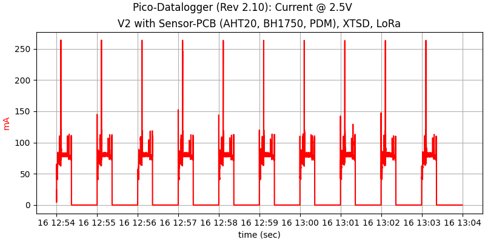
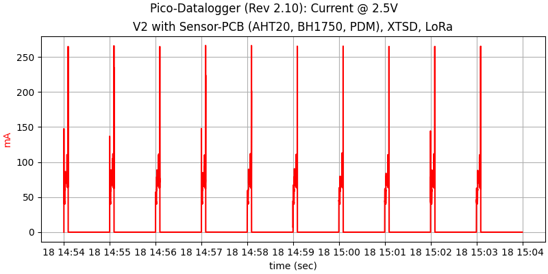
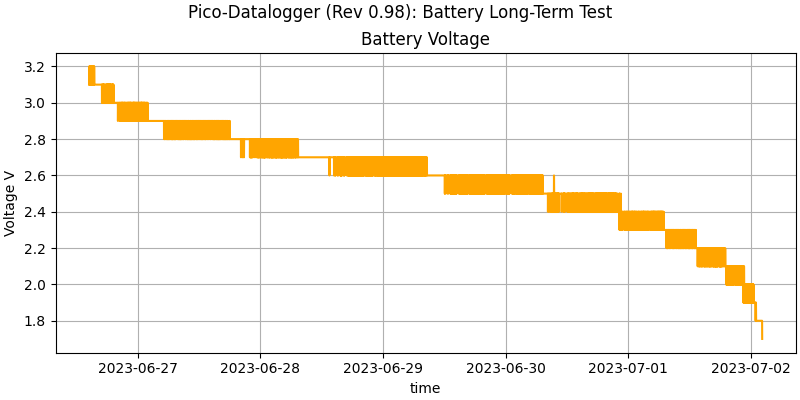

Power
=====

The board needs to be powered with one of the following options:

  - Two AA or AAA batteries
  - A LiPo battery

The RTC supports a CR2032 cell. This cell is not used for operation, it
just keeeps the internal state of the RTC when the standard batteries
are not connected. **Adding this coin-cell will shut down the RTC at
about 2.5V. This has no negative effect for LiPo-batteries which operate
above 3.0V, but for batteries, this severely limits the usable capacity.**

The power-management circuit has a leakage current of about 1.5µA during
"off-time" (at 3V).

Pico-W Current vs. Voltage
--------------------------

The Pico (-W) does not follow Ohm's law. It is more of a constant
energy-device. The consequence is that the current draw is higher for
lower voltages than for higher voltages. Also, the current ripple is
higher for low voltages, probably due to the internal DC-DC converters
that try to maintain the internal 1.8V and 3.3V voltages.

Some measurements (Pico-W):

| Voltage (V)| Idle Current (mA)|
|------------|------------------|
|         3.2|                49|
|         3.0|                53|
|         2.8|                55|
|         2.6|                65|
|         2.4|                69|
|         2.2|                82|

Operation Voltage and Capacity
------------------------------

The Pico-W works down to 1.8V, even with attached sensors. The exact
threshold voltage probably depends on the current draw of the attached
sensors and maybe some other factors (e.g. sample variation). Since
alkalines are considered "empty" at about 0.9V, this means that the
datalogger can theoretically use the full capacity of the cells.

Current Measurements
--------------------

The test-setup uses the datalogger-v2 PCB with the standard sensor-PCB:

  - AHT20 (temperature/humidity)
  - BH1750 (light)
  - PDM-mic (noise)

The results for these sensors (including writing to the XTSD-card,
update of the e-ink display and LoRa transmission):

The spike occurs during LoRa transmission and uses a relative high
current for a very short time. This spike is not the driver of the
total energy consumption.

The average current during a measurment cycle depends on the voltage
of the batteries. Some figures (mean of 10 measured cycles):

  - 2.5V: 28.5mA (0.47mAh per cycle)
  - 3.0V: 21.1mA (0.35mAh per cycle)
  - 3.7V: 15.9mA (0.27mAh per cycle)

These figures include current during "on-time" and current during
"off-time" which is essentially neglegible.

Without the display update, the "on-time" is much shorter and the
energy per cycle is also much smaller:

  - 2.5V: 6.6mA (0.11mAh per cycle)

A typical power curve will show a fast initial discharge followed by
a linear phase and again a final steep voltage drop at the end of the
life of the batteries:

This curve was created with one measurement cycle per minute which is
not the target setup. It is expected that lower duty-cycles will give
the battery more time to recover.

Extrapolated Current Usage
--------------------------

Using the figures from above for 2.5V (mean battery voltage during lifetime)
we have:

Four measurements per hour for 10 hours, i.e. 40 measurements
per day will consume

  - 40 * 0.47mAh = 18,8mAh (with display)
  - 40 * 0.11mAh =  4,4mAh (without display)

With measurements from Monday to Friday This would result in a runtime
of about 28 weeks (with display) or 122 weeks (without display) under the
assumption of a total capacity of 2700mAh for two fresh AA-batteries.
