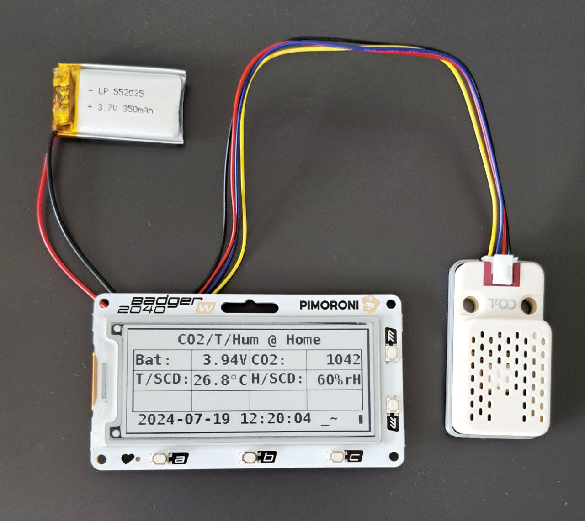
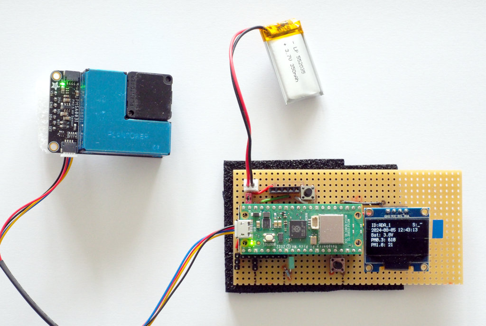

Examples
========

This directory contains a number of example setups for the
datalogger-software with standard breakout and components.

Badger2040W
-----------

The Badger2040W is an e-ink display with an integrated Pico-W from
Pimoroni. This device provides a RTC (PCF85063A) and very efficient
power management (with wake on RTC, so time-table based low power
operation is possible). A Stemma/Qt connector allows the connection of
standard sensor breakouts. There is no SD-card support, so data can be
collected and shown on the display, but not saved. Sending data to a
gateway using wifi is possible.

In the example setup, an SCD41 measures temperature, humidity and
CO2. This setup is ideal for a small, mobile air-quality measurement
system.

PiCowbell-Adalogger
-------------------

The PiCowbell-Adalogger is a Pico-sized breakout with a RTC (PCF8523),
a coincell backup battery and a SD-card slot. The interrupt pin of the
RTC is not exposed, so the RTC does not support wake on RTC and
therefore time-table based operation is limited to continuous mode
with deep-sleep.

The setup adds some external components on a perfboard, and thus
mimics most of the special datalogger hardware:

  - JST-PH2 connector for a battery pack/LiPo (upper left)
  - a 5-pin socket for a TPL5111 (to the right of the JST-PH2)
  - a reset button (the adalogger has one, but it is below the Pico-W)
  - a 4-pin socket for an I2C-OLED display (here with the display)
  - a button (used as application button SW_A, lower right)
  - a LED (used as application LED SW_D, in the middle)
  - some additional pins broken out (lower left)

The example here adds an PMS5003 particle sensor (connected via I2C)
and operates in continuous mode (without power-management,
i.e. without TPL511x). Data is not logged to the SD-card but the OLED
displays current data.

Picow-Solo
----------

This example is a standalone configuration for a Pico-W. It reads data
from <open-meteo.com> and prints the data to the console. The sampling
interval is 15 minutes, since the data-source does not provide new
data at a higher rate.

You should update the latitude and longitude in `config.py` to your
location (Open-Meteo provides a search function for this). Once up and
running, You should also disable logging in `log_config.py`:

    from log_writer import Logger
    g_logger = Logger(None)

This limits console-output to actual data:

    main.py Ausgabe:
    2024-08-05T13:22:34,22.1,63,1016,3,9.8,306,0.0
    2024-08-05T13:31:04,22.3,63,1016,3,9.7,309,0.0
    2024-08-05T13:46:04,22.5,63,1016,3,9.7,309,0.0

The configuration uses a time-table in continuous mode. In this mode,
the value of `INTERVAL` is ignored, but any interval shorter than 61
seconds still forces the system to use light-sleep instead of
deep-sleep in between sampling.

In a more realistic setup, the data would be at least written to a
SD-card.
