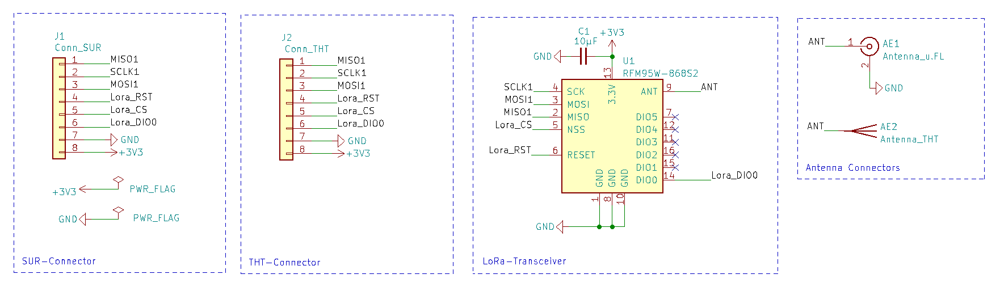
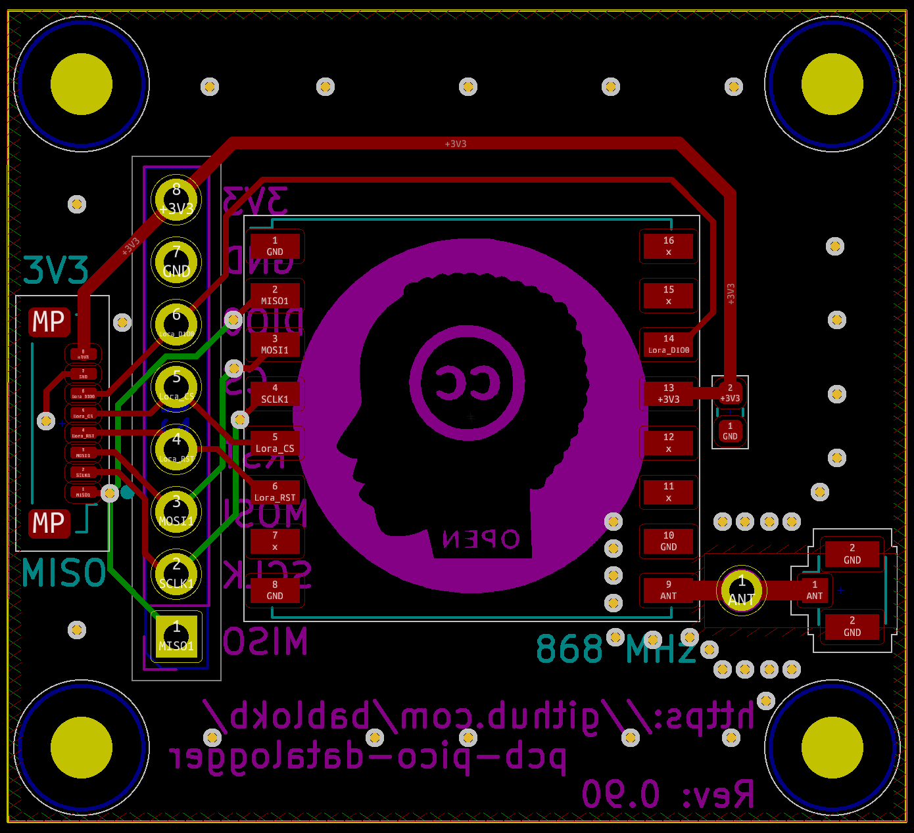
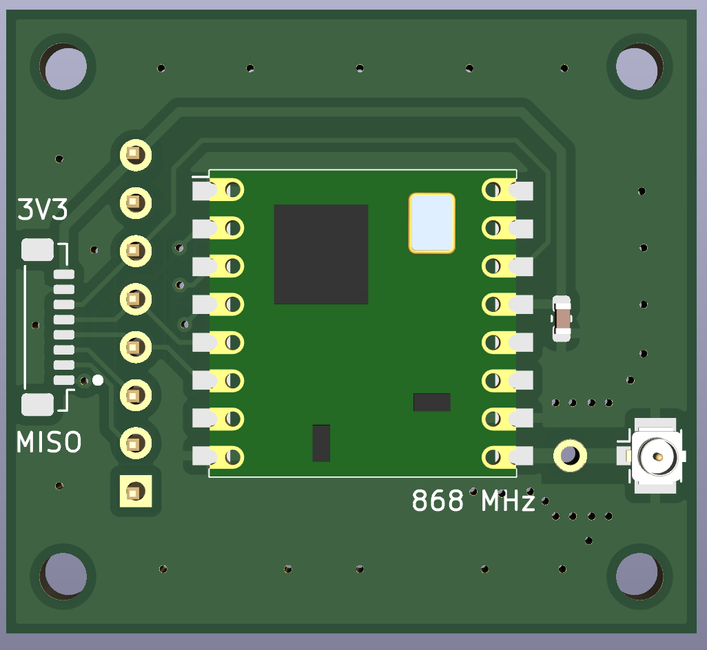
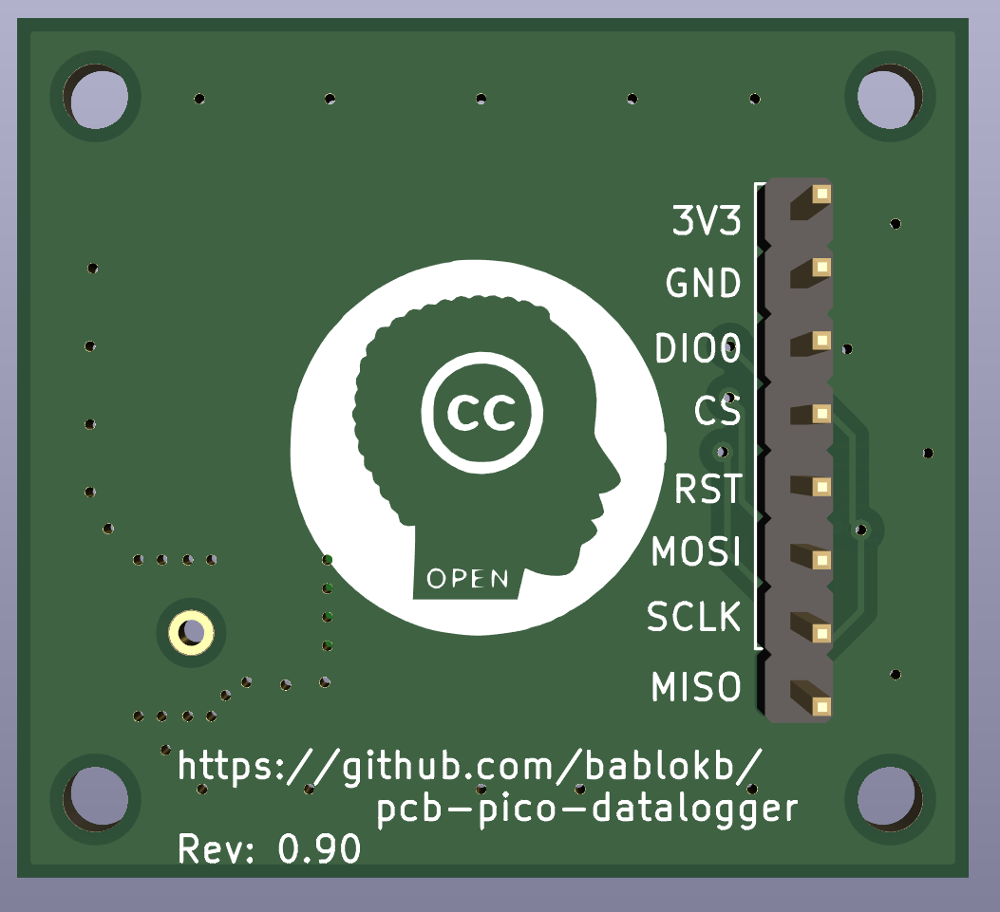

KiCAD-Designfiles
=================

Here are the KiCAD (v6) design-files for the LoRa-PCB.

This PCB is an integrated solution for a RFM9X-SMD-module and a
SURS-connector.

Schematic
---------

Layout
------

3D-Views
--------

