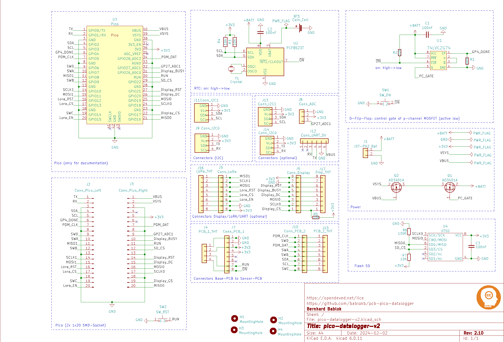
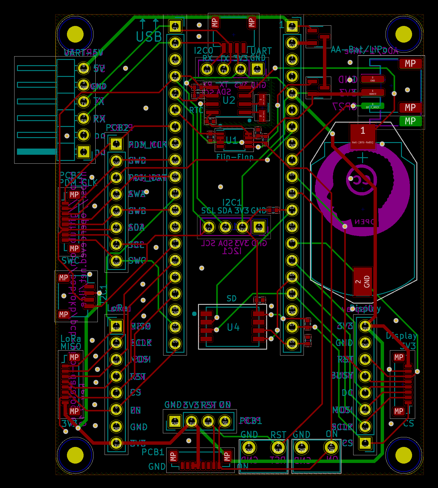

KiCAD-Designfiles for Version 2 PCB
===================================

Here are the KiCAD (v6) design-files for the Datalogger-V2-PCB.

Schematic
---------

Layout
------

3D-Views
--------

Wiring Version 2.00 (Gray Buttons, no Rim)
------------------------------------------

  - Base PCB to sensor PCB: 1x8pin type B, 1x4pin type B
  - Base PCB to display: 1x8pin type A

Wiring Version 2.10 (Red Buttons, with Rim)
-------------------------------------------

  - Base PCB to sensor PCB: 2x8pin type B
  - Base PCB to display: 1x8pin type B

Wiring LoRa-Adapter and LoRa-PCB
--------------------------------

The LoRa-adapter is for the Adafruit LoRa breakouts. The LoRa-PCB is our
own PCB including the RFM-chip, SURS-connector and u.FL-connector.

Wiring is independent of the base-PCB version.

LoRa adapters:

  - **Base PCB to LoRa-adapter 1.00**: 1x8pin **type B** 
    (SURS and sockets on opposite sides of PCB)
  - **Base PCB to LoRa-adapter 1.20**: 1x8pin **type A** 
    (SURS and sockets on the same side of the PCB)
  - **Base PCB to LoRa-adapter 1.30**: 1x8pin **type B** 
    (SURS and sockets on the same side of the PCB)

LoRa-PCBs:

  - **Base PCB to LoRa-PCB 0.90**: 1x8pin type **type A** 
    (0.90 is the 868 MHz version)
  - **Base PCB to LoRa-PCB 1.00**: 1x8pin type **type A** 
    (1.00 is the first 433 MHz version, maybe never in production?!)
  - **Base PCB to LoRa-PCB 1.10**: 1x8pin type **type B** 
    (1.10 is the second 433 MHz version)

