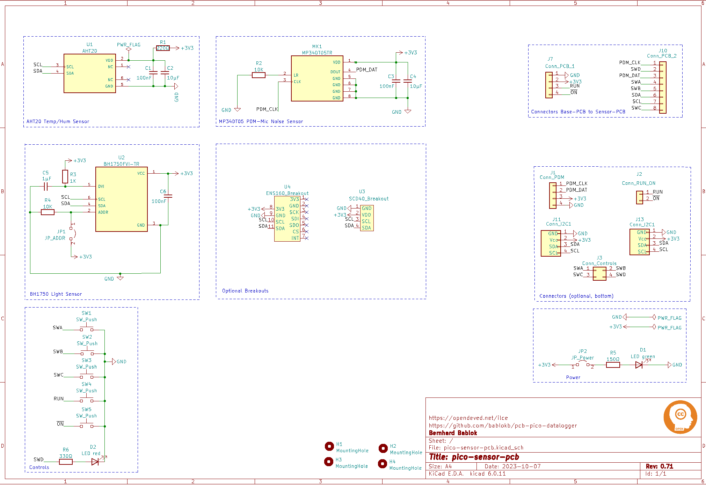
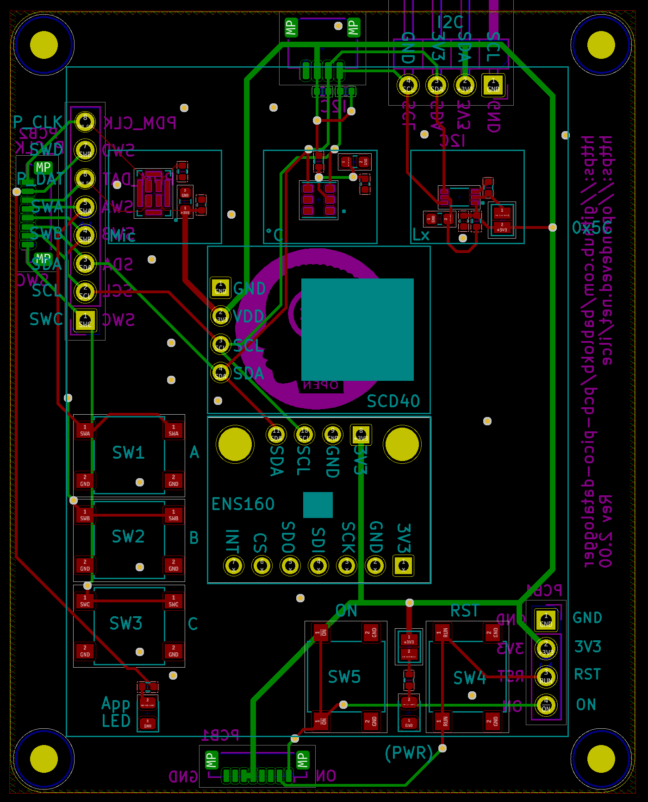
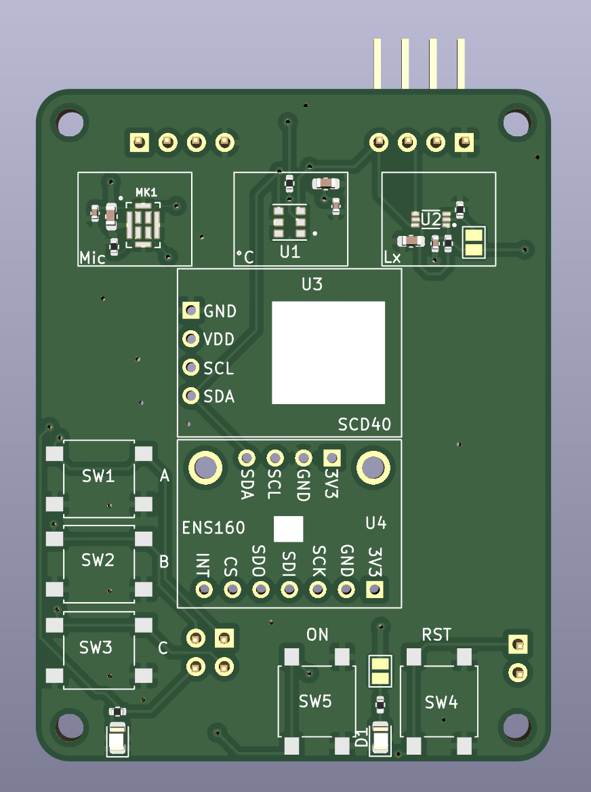
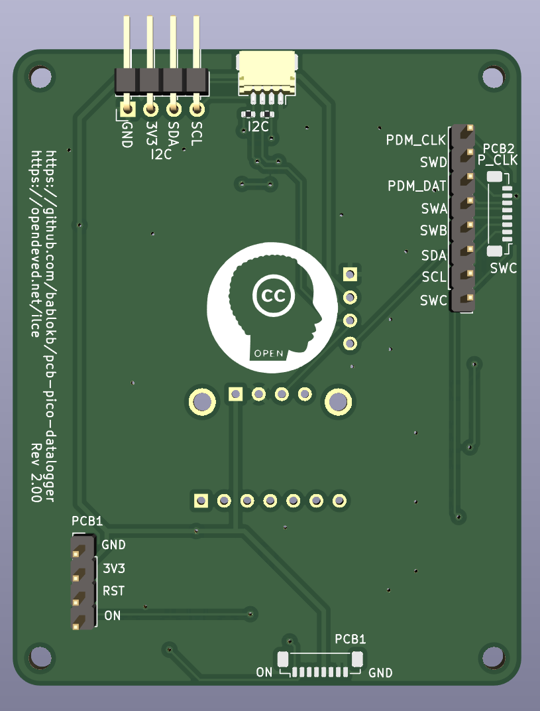

KiCAD-Designfiles for Sensor-PCB
================================

Here are the KiCAD (v6) design-files for the sensor-pcb.

Target components:

  - connectors to pico-datalogger-v2 pcb
  - AHT20
  - BH1750
  - PDM mic
  - connectors for I2C (Adafruit + Pimoroni layout)
  - ON button
  - RUN button
  - 4 buttons or LEDs
 

Schematic
---------

Layout
------

3D-Views
--------

